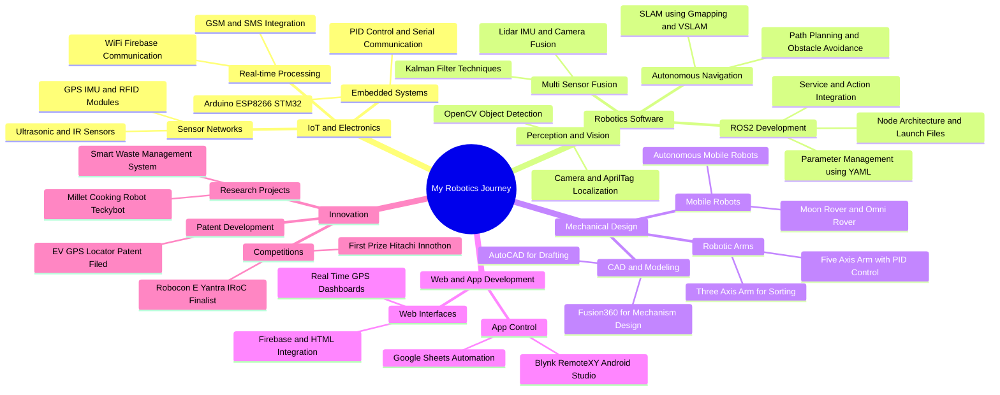

# Hi there! 👋 I'm Sai Sasivardhan

<div align="center">
  
  
  
  [](https://in.linkedin.com/in/sai-sasivardhan-gampa-59559a254)
  [](https://github.com/saisasi2004)
  [](https://www.instagram.com/sasivardhansai)
  [](mailto:gampassv2004@gmail.com)
  
</div>

---

## 🤖 About Me

> *"Building the future, one robot at a time"*

I'm a **Robotics Engineer** pursuing my B.Tech at the prestigious **National Institute of Technology, Warangal**. With expertise spanning **Electronics**, **ROS2**, **IoT**, and **Mechanical Design**, I specialize in creating innovative robotic solutions that bridge the gap between imagination and reality.

```python
class RoboticsEngineer:
    def __init__(self):
        self.name = "Sai Sasivardhan Gampa"
        self.role = "Robotics Engineer"
        self.location = "Hyderabad, Telangana, India"
        self.education = "B.tech, NIT Warangal"
        self.passion = ["Robotics", "Electronics", "Innovation"]
        
    def current_focus(self):
        return [
            "Advanced Robotic Systems",
            "Electronics and Firmware",
            "ROS2 Development",
            "IoT Integration",
            "Autonomous Navigation"
        ]
        
    def life_motto(self):
        return "Innovation through Integration"
```

---

## 🎓 Education

<table>
<tr>
<td>

**🎯 Current Studies**
- 🏛️ **NIT Warangal** (2022-Present)  
  B.Tech in Chemical Engineering  
  📊 **CGPA:** 7.58
  
- 🔌 **NIT Warangal** (2023-Present)  
  B.Tech in Electronics & Communication (Minor)  
  📊 **CGPA:** 9.25

</td>
<td>

**📚 Previous Education**
- 🏫 **Narayana Junior College** (2020-2022)  
  Board of Intermediate Education  
  📊 **Percentage:** 95.2%
  
- 🏫 **Pallavi Model School** (2019-2020)  
  Central Board of Secondary Education  
  📊 **Percentage:** 92.8%

</td>
</tr>
</table>

---

## 💼 Professional Experience

### 🏢 **Eternal Robotics** | *Intern*
**📅 Jun 2023 - Jul 2023 | 📍 Hyderabad, India**
- 🎯 Built automated **OCR pipeline** achieving **95% accuracy**
- ⚡ Developed custom GUI tool reducing image preprocessing time by **0.22s/image**
- 🚀 Significantly boosted pipeline throughput

### 🚀 **Mowito Robotics** | *Project Intern* 
**📅 Jun 2024 - Jul 2024 | 📍 Bengaluru, India**
- 🎯 Developed **eccentricity checking machine** with **97% accuracy**
- 🔧 Designed **robotic conveyor system** increasing efficiency by **40%**
- 💻 Integrated **ROS2 with STM32** using **OpenCV**

### 🤖 **Robotics Club, NIT Warangal** | *Secretary & Project Incharge*
**📅 Jan 2023 - Present | 📍 Warangal, Telangana**
- 📈 Developed Robotic arms and AGV's
- 🏆 Led teams in **eYantra** and **Robocon** competitions
- 🎯 Specialized in **electronics** and **robotic software**

---

## 🛠️ Technical Arsenal

<div align="center">

### 💻 Programming Languages


### 🔧 Tools & Frameworks


### 🗄️ Databases


</div>

---

## 📊 Skills Proficiency

<div align="center">

| Skill | Proficiency |
|-------|-------------|
| **Python** | Expert (85%) |
| **Embedded C** | Expert (90%) |
| **Web Development** | Expert (80%) |
| **C++** | Proficient (60%) |
| **ROS2** | Intermediate (40%) |
| **Mechanical Design** | Beginner (30%) |
| **Machine Learning** | Beginner (15%) |

</div>

---

## 🧠 Soft Skills

<div align="center">

| Skill | Description |
|-------|-------------|
| 🗣️ **Communication** | Articulating complex technical concepts clearly |
| 👥 **Leadership** | Leading and motivating teams to achieve results |
| 🔄 **Adaptability** | Thriving in dynamic environments and new technologies |
| 🧩 **Problem-Solving** | Analytical mind for identifying and resolving issues |

</div>

---

## 🚀 Featured Projects

<div align="left">

### 🔌 Electronics Projects

#### 🗑️ **Waste Management Robot**
*Intelligent waste segregation system*
- 🎯 **85%** waste identification accuracy
- 🦾 **3-axis robotic arm** for sorting
- 📦 **15kg** holding capacity

#### 🤖 **5-Axis Robotic Arm**
*Precision robotic manipulation system*
- 🎯 **95%** precision in segregation
- 👁️ **OpenCV** color recognition (90% accuracy)
- ⚙️ **Inverse kinematics** for precise placement

#### 📍 **Dynamic GPS Tracking System**
- Real-time location tracking with **30%** faster response
- **ESP8266** and **Firebase** integration
- **99%** data accuracy achievement

#### 🚁 **Quadcopter**
- Custom built flight controller and frame
- Stable flight dynamics and control
- **Status:** Flight Test

#### ⚙️ **CNC Machine**
- Precision automated machining tool
- G-code interpretation and execution
- **Status:** Operational

#### 📋 **RFID Attendance System**
- **25%** improvement in tracking accuracy
- **Google Sheets** integration
- **95%** reduction in manual errors

### 🤖 ROS2 & ML Projects

#### 🌙 **Moon Rover - ISRO IRoC-U**
*Advanced autonomous rover with V-SLAM navigation*
- 🎯 **40%** improvement in operational efficiency
- 📷 **Intel RealSense** depth camera integration
- 🧠 **V-SLAM & PID** algorithms implementation

#### � **Robotic Arm Simulation**
- ROS2 based simulation environment
- Kinematics validation and path planning
- **Status:** Simulation

#### � **AGV Simulation**
- Autonomous Guided Vehicle simulation
- Navigation stack implementation
- **Status:** Simulation

#### 🎨 **Color Identification Algo**
- Real-time color detection and segmentation
- Optimized for embedded systems
- **Status:** Tested

#### � **Face & Hand Identification**
- Biometric detection system
- Gesture recognition capabilities
- **Status:** Tested

### 🌐 Web Development Projects

#### 🔗 **CONNECTRA**
- Game-Arcade Website platform
- Interactive user interface
- **Status:** Live

#### � **Abhyas-AI**
- Educational AI platform
- Personalized learning experience
- **Status:** Beta

#### 🎮 **Game-Arcade Websites**
- Collection of browser-based games
- Responsive design and high performance
- **Status:** Live

</div>

---

## 🏆 Achievements & Recognition

<div align="center">

| 🥇 Achievement | 📅 Date | 🏢 Organization |
|----------------|---------|-----------------|
| 🥇 **1st Prize** - Hitachi's Innothon | Feb 2025 | NITW & Hitachi |
| 🥇 **Best Innovator & Innovation** | Jan 2025 | Innovation Garage |
| 📋 **Patent Filed** - EV GPS Locator | Dec 2024 | Patent Office |
| 🏆 **Top 150 Teams** - ISRO IRoC | Jan 2024 | ISRO IRoC Rover|
| 🥇 **1st Prize** - ECE Hackathon | Nov 2023 | NIT Warangal |
| 🥉 **4th Prize** - MJ's ACES Hack | Dec 2023 | MJ College |

</div>

---

## 📈 GitHub Stats

<div align="center">


</div>

---

## 🎯 Current Focus Areas



---

## 🤝 Let's Connect!

<div align="left">

💬 **Always excited to discuss:**
- 🤖 **Robotics** innovations and challenges
- 🔧 **Electronics** design and integration  
- 🌐 **IoT** solutions and architectures
- 🚀 **Technology** trends and opportunities

**📧 Reach out:** [gampassv2004@gmail.com](mailto:gampassv2004@gmail.com)  
**📱 Call me:** [+91-7661991859](tel:+91-7661991859)

---

*"The future belongs to those who believe in the beauty of their dreams and have the skills to make them reality."*

</div>

---

<div align="center">


[](https://github.com/saisasi2004)

**⭐ Please Do Follow My GitHub**

</div>
